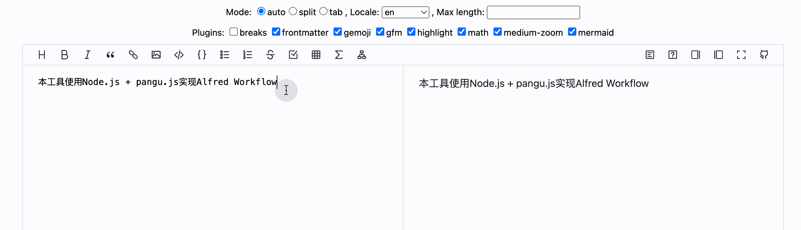
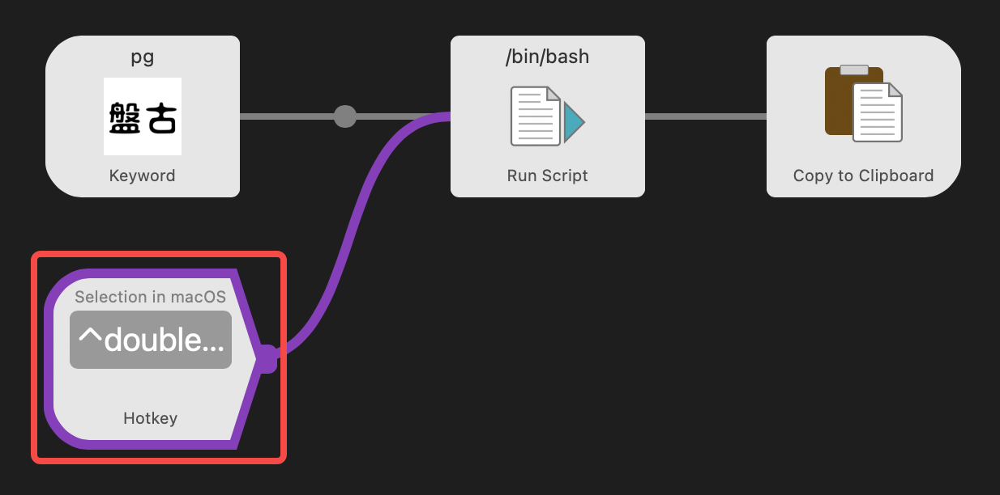
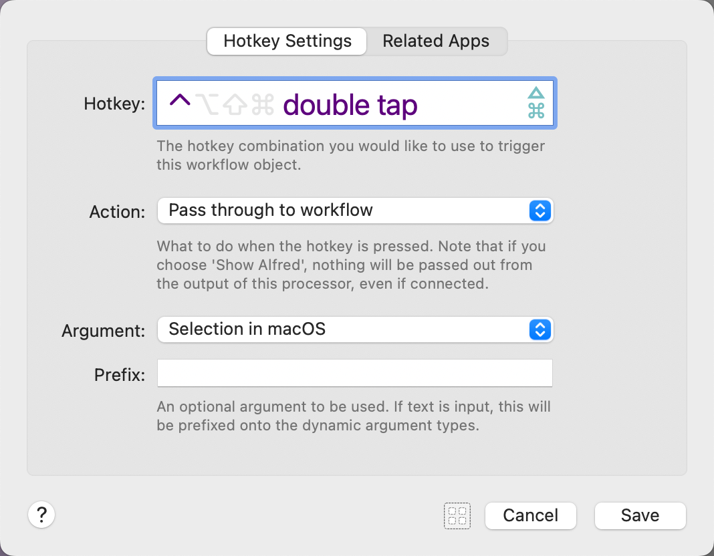

# Alfred Workflow Pangu

## 盘古之白

本工具使用 Node.js + pangu.js 实现 Alfred Workflow

## 使用方法

1. 勾选待格式化的文本，双击 Control（⌃）键，格式化后的文本自动替换选中文本（推荐）

2. 复制待格式化的文本，调用 Alfred 并输入 `pg`，回车后格式化后的文本将自动键入当前光标位置

## Tips

- 安装插件后快捷键丢失，或期望更改为自己喜欢的快捷键，可自行前往 Workflow 中的 Hotkey 模块修改

## 参考及鸣谢

- [vinta/pangu.js](https://github.com/vinta/pangu.js)
- [Norcy/alfred-workflow-pangu](https://github.com/Norcy/alfred-workflow-pangu)

## License
Released under the [MIT License](https://opensource.org/licenses/MIT).
